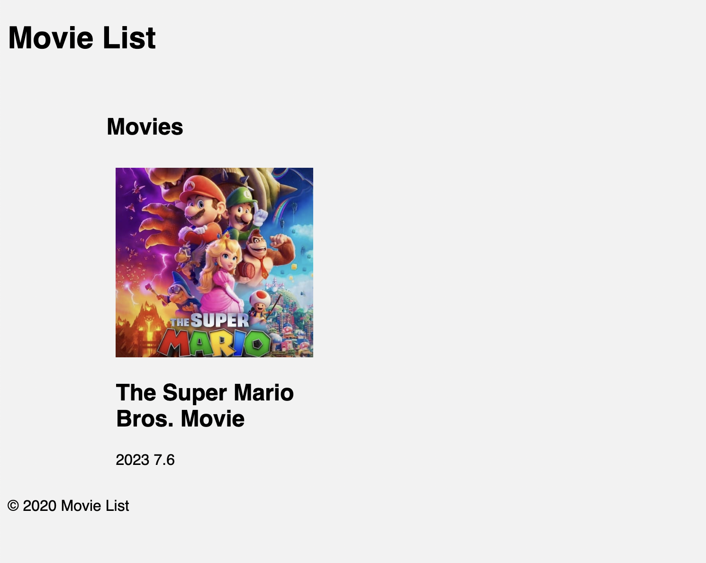
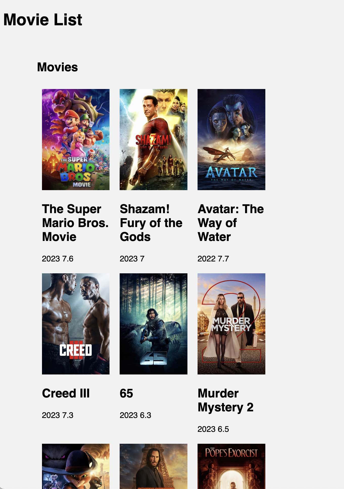

## Prompt for ChatGPT:

Please give me an easy HTML and Typescript project code with the following criteria:
- It should not use any framework.
- It should use async/await.
- It should contact a TMDB API.
- The HTML should display title, movie cover image, year and rating.
- The HTML should contain a static header and footer.
- It should add basic styles.


## Exercises 


### 1. Render a static movie item template.

Write a function that given a movie item it renders an HTML template string.

Input: 
```
const item = { 
	title: "The Super Mario Bros. Movie",
	release_date: "2023-04-05",
	poster_path: "/qNBAXBIQlnOThrVvA6mA2B5ggV6.jpg",
	vote_average: 7.6
};
getMovieTemplate(item)
```
Output:
```
<div class="movie">
    
    <h2>The Super Mario Bros. Movie</h2>
    <span>2023</span>
    <span>7.6</span>
</div>
```

### 2. Display the static item on the page

Import the function created on the previous exercise in `main.js` file to display the static template.

Output:


### 3. Create an account in TMDB and create an API_KEY

Follow the instructions below to create an API_KEY on the TMDB website:

1. Go to the TMDb website (https://www.themoviedb.org/) and sign up for a free account if you haven't already done so.
2. After signing in, click on your profile icon at the top right corner of the page, and select "Settings" from the dropdown menu.
3. Once on the Settings page, select the "API" tab.
4. On the API page, click the "Generate new API key" button.
5. You will be prompted to provide some details about your application. Fill in the required fields and submit the form.
6. That's it! Your API_KEY will be generated, and you can now use it to make requests to the TMDB API.

Make sure to keep your API_KEY safe and secure, as it provides access to your TMDB account information.

**Do not commit into git this API_KEY!**

Now we are going to test that the API_KEY you created works as expected and is accessible in the application:

1. Test that the API_KEY is valid: replace `<API_KEY>` on the following URL and open it in your browser, you should see a list of data returned.
	```
	https://api.themoviedb.org/3/discover/movie?sort_by=popularity.desc&api_key=<API_KEY>
	```
2. Make it accessible to the application using [Vite Support for ENV Variables](https://vitejs.dev/guide/env-and-mode.html#env-variables-and-modes). Create a file named `.env.local` with the following content, replace `<YOUR_API_KEY>` with your key.
	```
	VITE_API_KEY="<YOUR_API_KEY>"
	```
3. Test that the app can access to the ENV variable, to do that use `console.log` on `main.js`. You should see the key on your browser console.log.
	```
	console.log("My API_KEY is", import.meta.env.VITE_API_KEY)
	```

### 4. Write a function that retrieves movies from TMDB API

Now that you have available your API_KEY on the browser, create a function that:
- Interpolates the API_KEY in the TMDB API URL string.
	```
	https://api.themoviedb.org/3/discover/movie?sort_by=popularity.desc&limit=3&api_key=<YOUR_API_KEY>
	```
- Uses `fetch` to retrieve a list of movie items. [Using the Fetch API](https://developer.mozilla.org/en-US/docs/Web/API/Fetch_API/Using_Fetch)

Input: `getMoviesFromTMDB()`

Output:
```
{
  "page": 1,
  "results": [
    {
      "adult": false,
      "backdrop_path": "/9n2tJBplPbgR2ca05hS5CKXwP2c.jpg",
      "genre_ids": [
        16,
        12,
        10751,
        14,
        35
      ],
      "id": 502356,
      "original_language": "en",
      "original_title": "The Super Mario Bros. Movie",
      "overview": "While working underground to fix a water main, Brooklyn plumbers—and brothers—Mario and Luigi are transported down a mysterious pipe and wander into a magical new world. But when the brothers are separated, Mario embarks on an epic quest to find Luigi.",
      "popularity": 10312.202,
      "poster_path": "/qNBAXBIQlnOThrVvA6mA2B5ggV6.jpg",
      "release_date": "2023-04-05",
      "title": "The Super Mario Bros. Movie",
      "video": false,
      "vote_average": 7.6,
      "vote_count": 823
    },
	/* ... the rest of the results are removed from output to keep it simple */
  ]
  "total_pages": 37893,
  "total_results": 757854
}
```

### 5. Modify the `getMoviesFromTMDB()` function to match our application data

Now modify the function from the previous exercise to return the data that we use on our application.

Input: `getMoviesFromTMDB()`
Output:
```
[
	{ 
		title: "The Super Mario Bros. Movie",
		release_date: "2023-04-05",
		poster_path: "/qNBAXBIQlnOThrVvA6mA2B5ggV6.jpg",
		vote_average: 7.6
	},
	/* ... the rest of the results are removed from output to keep it simple */
]
```


### 6. Render the full list of movies

On the exercise 2 you rendered a single movie item on the page. Now modify the `main.js` code to render the full list of movies using an iterator.
1. Use the `getMoviesFromTMDB()` from previous exercise to get the movie items.
2. Use the `getMovieTemplate(item)` to generate the template for the movie
3. Display the generated templates on the `#movies-container` element

Output:



