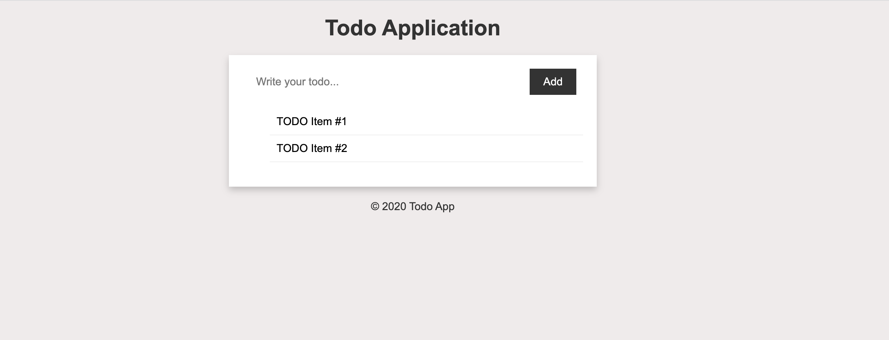
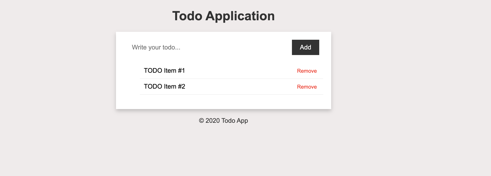
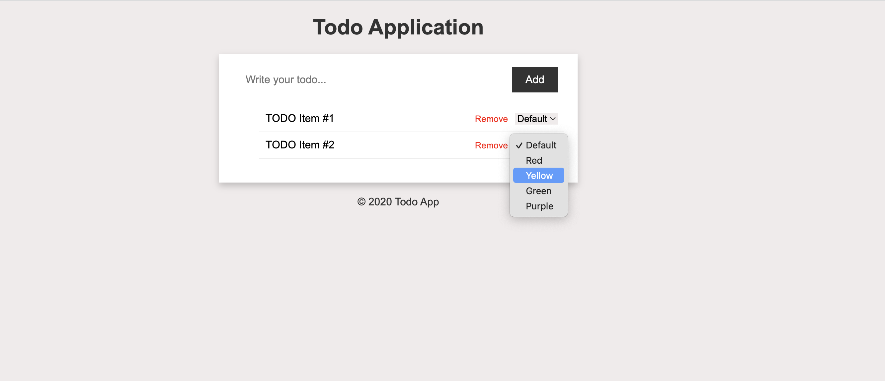
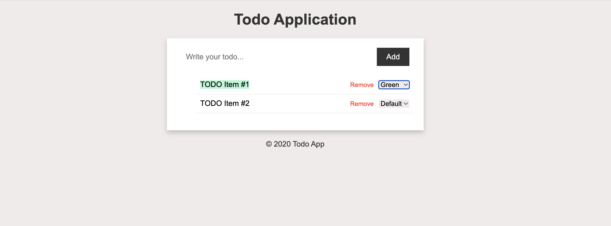

# TODO Application

A Todo application is a good way to start thinking of having track of data in javascript (state of the application) and update the user UI to reflect the state.

You can follow this tutorial first to get inspired and then tackle this exercise.

https://freshman.tech/todo-list/#prerequisites


## 1. Add the CSS for the given HTML

Given the following HTML, add the style to match the design.
```html
<main id="app">
  <div class="todo-list">
    <form action="#" class="todo-form">
      <input type="text" placeholder="Write your todo..." />
      <button type="submit">Add</button>
    </form>

    <ul class="todos">
      <li class="todo-item">
        <span>TODO Item #1</span>
      </li>
      <li class="todo-item">
        <span>TODO Item #2</span>
      </li>
    </ul>
  </div>
</main>
```

Here are the colours that you may need to use:
```css
#f0ebeb
#333
#eee

#f0ebeb
```




## 2. Add functionality to add TODO's

Now make the TODOs list to be dynamic, allowing the user to write the todo and add it to the list. **Remember to think which data structures you may need on your program** (Object, Array, String...)

Hints:
1. **Get references to the HTML elements you need** - In order to interact with the DOM using JavaScript, you'll first need to use the `document.querySelector()` method to get references to the HTML elements that you want to manipulate. For example, you'll need to get a reference to the input field where the user enters their TODO item, as well as a reference to the button that they click to add it to the list.

2. **Add an event listener to detect when the form is submitted** - Once you have references to the relevant HTML elements, you can use the `.addEventListener()` method to add an event listener that detects when the user submits the form by clicking the "Add" button. When this happens, you'll want to call a function that handles adding the new TODO item to the list.

3. **Write a function to handle adding new TODO items** - This function should be responsible for taking the user's input from the input field, creating a new HTML element (probably a `<li>`), populating it with the user's input, and adding it to the list of TODO items in the DOM. You'll also need to update any data structures or variables that you're using to keep track of the list of TODO items.


## 3. Add functionality to remove TODOs

Now modify the list item template to include a button to remove the todo item from the list. You should also add the CSS to make it look like the design. 

```html
<li class="todo-item">
  <span>TODO Item #1</span>
  <div>
    <button class="remove-btn">Remove</button>
  </div>
</li>
```



Hints:
1. **Add event listeners to detect when items are removed** - In order to allow users to remove items from the list, you'll need to add an event listener to each `<li>` element that detects when the user clicks the "Remove" button associated with that item. This will require using `.querySelector()` or similar to target the appropriate button within each item, and then using `.addEventListener()` to set up the event listener itself. **Remember that the elements must be created in the DOM before adding the event listeners.** This can be difficult, you can take a look at how this is done in this tutorial: https://freshman.tech/todo-list/#delete-todo-items

2. **As this may be a bit difficult, I recommend you to inspect these values:**
  ```js
    document.querySelector('.todo-item')
      .addEventListener('click', function(event) {
        console.log(this)
        console.log(this.querySelector('span'))
        console.log(event.target.classList)
      });
  ```

3. **Write a function to handle removing items** - When an item is removed, you'll need to remove its corresponding HTML element from the DOM, and update any data structures or variables used to keep track of the list of TODO items.


## 4. Add functionality to change TODO background-color

Now modify the list item to display a list of colors, when the color is selected modify the style of the todo item to change the `background-color` to the value of the select. **This may require your data structure in Javascript to be modified, the todo **

```html
<li class="todo-item">
  <span>TODO Item #1</span>
  <div>
    <button class="remove-btn">Remove</button>
    <select class="background-change">
      <option value="#f0ebeb">Default</option>
      <option value="#ffd6d6">Red</option>
      <option value="#ffe066">Yellow</option>
      <option value="#b4f7d8">Green</option>
      <option value="#c9caf2">Purple</option>
    </select>
  </div>
</li>
```




Hints:
1. **Add event listeners to detect when colors are changed** - Finally, you'll need to add an event listener to each `<select>` element in the list that detects when the user chooses a different color for the corresponding item. You can use `.addEventListener()` again to do this.

2. **As this may be a bit difficult, I recommend you to inspect these values:**
    ```js
    document.querySelector('.todo-item')
      .addEventListener('change', function(event) {
        console.log(this)
        console.log(this.querySelector('span'))
        console.log(event.target.value)
      });
    ```

3. **Write a function to handle changing the color** - When a color is changed, you'll need to update the CSS `background-color` property of the relevant HTML element to be the selected color. 


